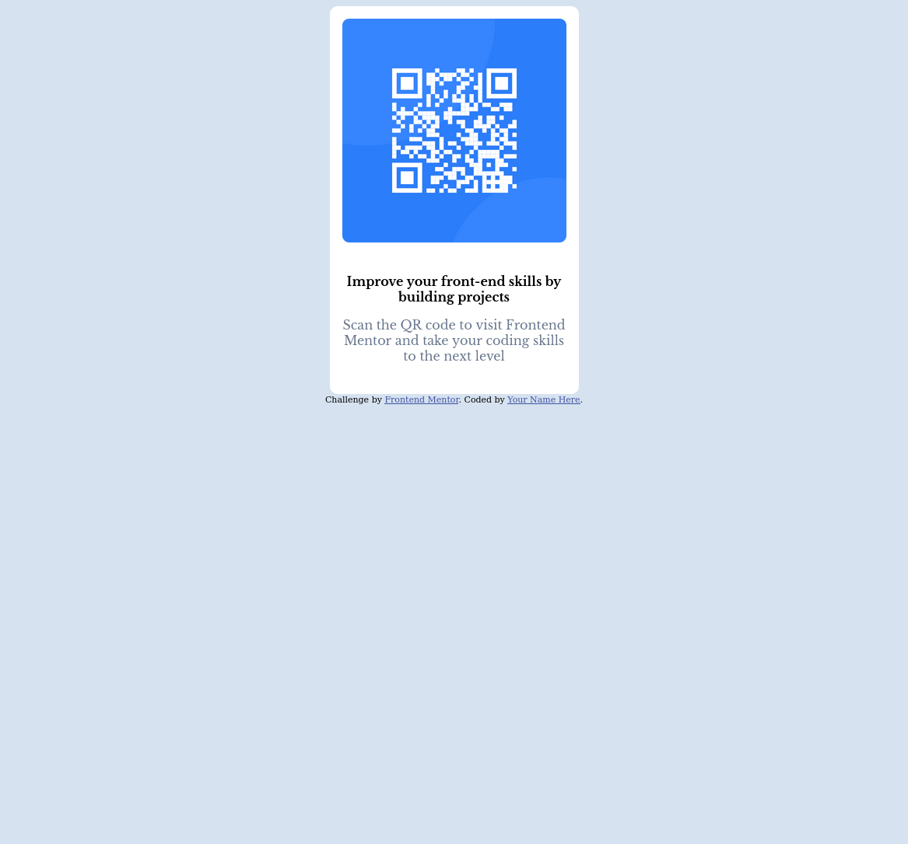

# Frontend Mentor - QR code component solution

This is a solution to the [QR code component challenge on Frontend Mentor](https://www.frontendmentor.io/challenges/qr-code-component-iux_sIO_H). Frontend Mentor challenges help you improve your coding skills by building realistic projects. 

## Table of contents

- [Overview](#overview)
  - [Screenshot](#screenshot)
  - [Links](#links)
- [My process](#my-process)
  - [Built with](#built-with)
  - [What I learned](#what-i-learned)
  - [Continued development](#continued-development)
  - [Useful resources](#useful-resources)
- [Author](#author)


## Overview

### Screenshot




### Links

- Solution URL: [Solution URL here](https://github.com/bandianconde/qr-code-main-component-flexbox)
- Live Site URL: [Live site URL](https://qr-code-main-component-flexbox.vercel.app/)

## My process

### Built with

- Semantic HTML5 markup
- CSS custom properties
- Flexbox


### What I learned

I use flexbox 

To see how you can add code snippets, see below:


```css
.main {
    display: flex;
    width: 320px;
    height: 499px;
    margin: 0 auto;
    flex-direction: column;
    background-color: white;
    justify-content: flex-start;
    gap: 24px;
    align-items: center;
    border-radius: 10px;
    flex-basis: 288px;
}
```


### Continued development

I never use CssGrid I would like to practrice it on
future projects.

### Useful resources

- [ CSS Flexbox Layout Guide ](https://css-tricks.com/snippets/css/a-guide-to-flexbox/) - This helped me for flexbox visual effects


## Author

- Frontend Mentor - [@bandianconde](https://www.frontendmentor.io/profile/bandianconde)


